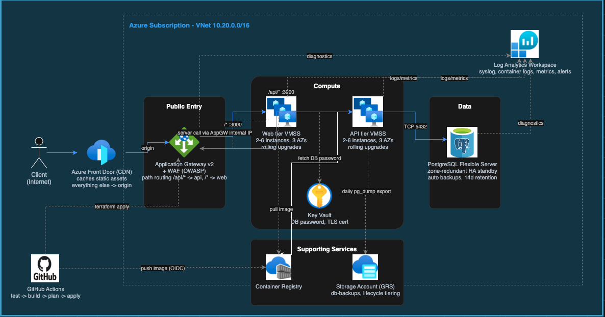

# Architecture: step by step, and the choices behind it

Here I have described everything about the architecture choices and
design of the infrastructure, from deployment to exposing it to the end
user.

## Diagram

The source file is [docs/architecture.drawio](architecture.drawio), open
it in [diagrams.net](https://app.diagrams.net) if you want to zoom in or
edit it live. The four gray boxes are the same four groupings I use in
the walkthrough below: Public Entry (the gateway), Compute (the two VMSS
tiers), Data (Postgres), and Supporting Services (ACR plus backup
storage). Key Vault, GitHub Actions, and Log Analytics sit outside those
boxes because they support everything rather than sitting on the request
path itself.

## The 30 second version

A client hits Front Door, which sends them to one Application Gateway,
which routes to either the web tier or the api tier depending on the
path. The web and api tiers are both VM Scale Sets running Docker
containers, spread across availability zones, autoscaled, and updated
through rolling upgrades so nothing goes down mid deploy. The api tier
is the only thing allowed to talk to Postgres, and Postgres itself has
no public endpoint at all. Everything is provisioned by Terraform, and
GitHub Actions builds, tests, and deploys it on every push to main, with
a human approving the infrastructure change before it goes out.

## How a request actually flows, step by step

Following the diagram left to right:

1. Client hits Azure Front Door. DNS resolves to Front Door's anycast
   edge, so the client connects to whichever point of presence is
   geographically closest, not to a fixed region. This is the CDN part
   of the requirements: static assets like images and stylesheets get
   cached at the edge, everything else gets forwarded to origin on every
   request, that's the arrow labelled origin on the diagram.
2. Front Door forwards into the Public Entry box, which is the
   Application Gateway's public IP. This is the one and only public
   entry point into the VNet. The gateway runs WAF v2 with the OWASP
   Core Rule Set turned on, so anything that looks like SQL injection,
   cross site scripting, or a handful of other known attack patterns
   gets blocked before it ever reaches either tier.
3. The gateway does path based routing into the Compute box. Anything
   under /api/ goes to the api tier, everything else goes to the web
   tier. Both tiers sit in their own subnet with their own network
   security group, I drew them as one grouped box because they're both
   stateless, both autoscaled, and both updated the same way.
4. The web tier calls the api tier internally, but not directly, it
   loops back out through the gateway's internal frontend IP using the
   same /api/ rule that public traffic uses, that's the arrow going back
   into Public Entry. I did this on purpose: there's only one WAF policy
   and one routing table to reason about, the internal call gets the
   same protection public traffic gets, and I don't need a second
   internal load balancer just for traffic between the two tiers.
5. The api tier talks to Postgres over port 5432, into the Data box.
   Only the api subnet's network security group is allowed to reach that
   port on the database subnet. Postgres itself has no public network
   access at all, so there's no endpoint to even attempt to reach from
   outside the VNet.
6. Both VMSS tiers pull their container images from the Supporting
   Services box, using the instance's own managed identity, so there are
   no registry credentials stored anywhere. The api tier also reaches
   into Key Vault, drawn on its own since both the api tier and the
   gateway depend on it, to fetch the database password at boot, and the
   gateway does the same thing for its TLS certificate.
7. Every tier ships logs and metrics to Log Analytics, drawn in the top
   right corner since it's a destination everything feeds into rather
   than a stop along the request path. Nobody needs to log into a
   machine to read a log line.
8. GitHub Actions, drawn bottom left and outside the VNet boundary, is
   what actually puts everything else there in the first place. It
   builds and pushes images into the container registry, and once a
   plan is approved, runs terraform apply against the gateway and
   everything behind it. It sits outside the dotted subscription
   boundary on purpose, it's the one part of this that doesn't run
   inside Azure at all.
9. A daily job, also GitHub Actions, triggers a database export on one
   api instance and uploads the result into the Supporting Services
   storage account.

## Design choices and why

### VM Scale Sets and Docker instead of AKS or Container Apps

The app wasn't containerised to begin with, and the task itself asks for
runtime handling scripts that start, stop, and scale nodes, which points
at VM level control, something a managed platform like Container Apps or
AKS mostly takes away from you. There's no real node to start or stop on
those. VM Scale Sets give me an actual node to script against, rolling
health gated updates built in with nothing to hand roll, and Docker
without needing a custom VM image pipeline, since the base image barely
changes and only the container tag changes per deploy.

I did think about AKS. It would have been the more expected answer on
paper, but it also would have meant either hiding the exact thing the
task is asking me to show, which is node level operational control, or
building scripts around kubectl that don't really do anything a real ops
team would do day to day. VMSS felt like the honest answer to what was
actually asked.

### One Application Gateway instead of two

Both tiers being publicly exposed doesn't mean they need separate public
IPs. Path based routing on a single gateway keeps one WAF policy, one
certificate, and one thing to monitor, and it matches how I'd actually
run this in practice: the api tier isn't meant to be hit directly by end
users anyway, it's an implementation detail of the web tier that happens
to also be reachable directly for testing.

### TLS through Key Vault and Let's Encrypt instead of a paid certificate

HTTPS isn't explicitly required by the task, but shipping a plain HTTP
public endpoint felt wrong to hand in, and a real certificate costs money
I didn't want to spend on an interview exercise. The gateway reads the
certificate out of Key Vault through a managed identity, so the private
key never sits in Terraform state or anywhere else. Plain HTTP redirects
to HTTPS for everything except the ACME challenge path, which stays on
HTTP on purpose so future renewals keep working.

One thing I didn't automate is renewal. The certificate was issued once
by hand, using certbot in manual mode with a small hook script, and
expires after 90 days. Automating it properly would mean either a
scheduled job running the same hook, or moving to DNS based challenges
if the domain ever moves off the Azure provided hostname to something
with DNS I control myself.

### GitHub Actions instead of git.toptal.com's own pipeline

git.toptal.com's GitLab instance has no active runners for this project,
so a pipeline defined there just sits pending forever, I actually tried
that first and hit exactly that wall. The task allows using another git
provider for this reason. So the pipeline runs on GitHub Actions against
a mirror of this repository, while the workflow files themselves still
live here in the Toptal repo like everything else. See
[docs/infrastructure.md](infrastructure.md) for exactly how that's wired
up and how to run it yourself.

### Manual approval on terraform apply, not on the app deploy

I think that's the right split. An unattended infrastructure change is a
different kind of risk than an unattended app deploy. The app deploy,
meaning the image tag bump and the rolling update it triggers, is what's
actually fully automated end to end. Applying infrastructure changes
waits for a human, through a GitHub environment with a required
reviewer.

## How each requirement is met

| Requirement | Implementation |
|---|---|
| Web and API tiers exposed to the internet | One Application Gateway with a public IP, doing path based routing: anything under /api/ goes to the api backend pool, everything else goes to web. |
| DB tier not accessible from the internet | Postgres sits inside the VNet with public network access turned off entirely, in its own subnet whose network security group only allows the api subnet through on port 5432. |
| Fully provisioned via IaC | Everything, the network, the registry, Key Vault, both scale sets, the gateway, Postgres, Log Analytics, Front Door, storage, and even the GitHub identity the pipeline uses, is Terraform. Destroy the whole stack and applying again rebuilds it. |
| Handles server or instance failures | VMSS spreads instances across three availability zones, automatic instance repair replaces anything that fails its health probe, and autoscale keeps a minimum instance floor. I actually tested this live: deleted a running web instance directly, autoscale had a healthy replacement up in under two minutes, and the site stayed up the whole time. |
| Zero downtime updates | Both scale sets run rolling upgrades, gated by a health check on each container. Applying with a new image tag triggers this automatically. Also tested live: pushed a small change through the pipeline and watched one instance roll onto the new version while the other kept serving traffic, no dropped requests. |
| Fully automated deploys, plus tests | GitHub Actions tests both tiers, builds and pushes images tagged with the commit hash, plans the infrastructure change, then applies it behind a manual approval. Both tiers have real tests that run on every push, and the api tests run against an actual Postgres container rather than a mock. |
| Backups at least daily | Postgres has its own automated backups always running, two weeks of retention, geo redundant, no script needed. On top of that a daily job exports a full database dump and uploads it to separate storage with its own lifecycle rules. |
| Logs accessible off host | Every instance ships its logs to one central Log Analytics workspace. The gateway and Postgres send their diagnostics there too. Nobody needs to log into a machine to read anything. |
| Historical metrics, spotting bottlenecks | The same workspace holds CPU, gateway latency, unhealthy host counts, and database metrics for 90 days, queryable directly, with an alert already wired up for unhealthy backend hosts. |
| CDN, distributed by client location | Azure Front Door sits in front of the gateway, caching static assets at the edge closest to each client while dynamic traffic goes straight to origin. Turned off in the current live deployment, explained below. |
| Deployable on a major cloud provider | Azure. |

## What's actually running versus what's designed

The Terraform supports the full design above. What's live right now
differs in two places, and both come down to restrictions on the
specific subscription I deployed to for this interview, not the design
itself.

Postgres high availability is turned off. The subscription rejected zone
redundant HA in every region I tried, it simply isn't offered on this
tier. Flipping one variable turns it back on for a normal subscription.

The CDN is turned off too. Azure rejects Front Door outright on trial or
student subscriptions. Same story, flipping one variable turns it on for
a standard subscription.

Also worth mentioning if it comes up: the subscription's total regional
vCPU quota is 4, which ruled out the VM size I originally picked. The
live deployment uses a smaller size so two web instances and two api
instances fit inside that quota. That size is a variable for exactly
this reason. The full story of how I found that limit is in
[docs/challenges.md](challenges.md).