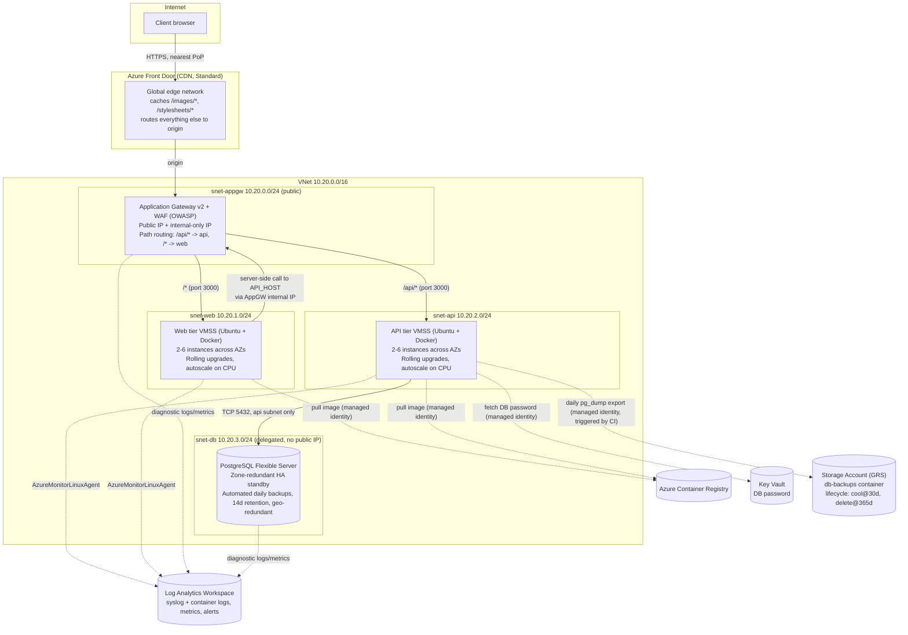

# Architecture: node-3tier-app2 on Azure

This is the architecture write-up the task asks for ("An architectural
diagram / PPT to explain your architecture during the interview"). I kept
it as markdown with a Mermaid diagram instead of a slide deck, mostly
because it's easier to keep it in sync with the actual Terraform as things
change, and it renders fine on both git.toptal.com and GitHub.

## Diagram

This diagram is the "as designed" version. The actual deployed
environment for the interview runs a couple of things differently for
reasons that have nothing to do with the design, see the note at the
bottom.

## How each requirement is met

| Requirement | Implementation |
|---|---|
| Web and API tiers exposed to the internet | One Application Gateway v2 with a public IP, doing path-based routing: `/api/*` goes to the API backend pool, everything else goes to web. Both tiers are reachable from the internet through it, and there's only one public IP/WAF policy to manage instead of two. |
| DB tier not accessible from the internet | Postgres Flexible Server is VNet-integrated with public network access turned off entirely (`delegated_subnet_id` + `public_network_access_enabled = false`), sitting in its own subnet whose NSG has no internet-facing inbound rule at all, only TCP 5432 from the API subnet. |
| Fully provisioned via IaC | Everything (network, ACR, Key Vault, both VMSS, App Gateway, Postgres, Log Analytics, Front Door, Storage) is Terraform, split into modules under `infra/terraform/modules` with one `environments/prod` root wiring them together. |
| Handles server/instance failures | VMSS spreads instances across 3 Availability Zones, `automatic_instance_repair` replaces anything that fails its health probe, and autoscale keeps a minimum instance floor so a lost instance gets backfilled rather than just noticed. Postgres supports zone-redundant HA with an automatic-failover standby (see the note below on why it's off in the current deployment). |
| Zero-downtime updates | Both VMSS run `upgrade_mode = "Rolling"` with a batched rolling upgrade policy, gated by an `ApplicationHealthLinux` extension checking each container's health endpoint. A `terraform apply` with a new image tag triggers this automatically, no separate "start an instance refresh" step. |
| Fully automated deploys, plus tests | GitHub Actions (`.github/workflows/ci-cd.yml`): test, build and push to ACR tagged with the git SHA, `terraform plan`, then `terraform apply`, which bumps the VMSS image tag and lets the rolling policy roll it out. Both tiers have real tests that run on every push, the API tests run against an actual Postgres service container rather than mocks. |
| Backups at least daily | Postgres's own automated backups (`backup_retention_days = 14`, geo-redundant) are always on and need no script at all. On top of that, a daily GitHub Actions workflow runs `pg_dump` on one API instance via `az vmss run-command` (so the runner never needs network access to the private DB) and uploads the compressed dump to a geo-redundant storage account with lifecycle tiering. |
| Logs accessible off-host | Every VMSS instance runs the AzureMonitorLinuxAgent extension, shipping syslog and container logs to a central Log Analytics workspace. App Gateway and Postgres diagnostics land in the same workspace. You never need to SSH into a host to read a log. |
| Historical metrics, spotting bottlenecks | Log Analytics plus Azure Monitor metrics (CPU, App Gateway latency/unhealthy-host-count, Postgres metrics) with 90 days of retention, queryable via KQL, with an alert on unhealthy backend hosts. |
| CDN, distributed by client location | Azure Front Door in front of the Application Gateway, caching static assets (`/images/*`, `/stylesheets/*`) at the edge closest to each client while dynamic HTML/API responses always go straight to origin. |
| Deployable on a major cloud provider | Azure. |

## Why VMSS + Docker + ACR instead of AKS or Container Apps

The app wasn't containerized to start with, and the task's own wording
("runtime handling scripts: start/stop/scale nodes") points at VM-level
control, which a managed platform like Container Apps or AKS mostly
abstracts away, there's no real "node" to start or stop on those. VM
Scale Sets give:

- An actual node to script against (`infra/scripts/runtime/{start,stop,scale}.sh`).
- Rolling, health-gated updates built in, no orchestration to hand-roll.
- Docker without needing a custom VM image pipeline: the base image
  barely changes (Ubuntu + Docker + the monitoring agent, set up once via
  `custom_data`), and only the container image tag changes per deploy,
  pulled from ACR with the instance's managed identity so no registry
  credentials live anywhere.

## What's actually running vs. what's designed

The Terraform supports the full design above. What's live right now
differs in two places, both because of restrictions on the Azure
subscription I deployed to for this interview, not the code:

- **Postgres HA is off** (`enable_postgres_ha = false`). The subscription
  hit `MultiAzHaIsOfferRestricted` in every region I tried, zone-redundant
  HA just isn't offered on this tier. Flip the variable back to `true` on
  a normal subscription and it works as designed.
- **Front Door/CDN is off** (`enable_cdn = false`). Azure rejects it
  outright on trial/student subscriptions ("Free Trial and Student
  account is forbidden for Azure Frontdoor resources"). Same story, flip
  `enable_cdn = true` on a standard subscription.

Also worth flagging since it came up while deploying: the subscription's
regional vCPU quota is 4 total, which ruled out the VM size I originally
picked (`Standard_B2s`, 2 vCPU each, would have needed 8 across both
tiers) and even smaller B-series sizes weren't available at all in some
regions. The live deployment uses `Standard_F1as_v7` (1 vCPU) so 2 web +
2 api instances fit inside the quota. `vm_sku` is a variable for exactly
this reason.

## TLS

The Application Gateway has a real HTTPS listener with a Let's Encrypt
certificate (that's what the DNS label on the public IP is for, Let's
Encrypt needs a real hostname to issue against, not a bare IP). The cert
is stored in Key Vault and the gateway reads it through a user-assigned
managed identity, no private key sitting in Terraform state or anywhere
else. Plain HTTP redirects to HTTPS for everything except
`/.well-known/acme-challenge/*`, which stays on HTTP on purpose so future
renewals keep working.

It's turned on via `tls_certificate_key_vault_secret_id` on the
`appgateway` module, empty string means HTTP only, so the module still
works standalone before a certificate exists.

One thing not automated: renewal. The cert was issued once by hand
(certbot in manual mode, with a hook script that drops the challenge
file straight into the running web container via `az vmss run-command`)
and expires in 90 days. Automating that would mean either a scheduled
job with the same hook approach, or switching to DNS-01 challenges if the
domain ever moves off `*.cloudapp.azure.com` to something with DNS I
actually control.

## Other things I'd change given more time

- **CI trust**: the pipeline authenticates to Azure over OIDC federation
  rather than a stored client secret, but git.toptal.com has no active
  runners for this project, so the pipeline actually executes on GitHub
  Actions against a mirror of this repo. The workflow code itself still
  lives here in Toptal git, only the execution moved, which the task
  explicitly allows.
- **`terraform apply` needs manual approval** in the pipeline rather than
  running unattended. I think that's the right call, an unattended infra
  change is a different risk than an unattended app deploy, and the app
  deploy (the image tag bump) is what's actually fully automated here.
