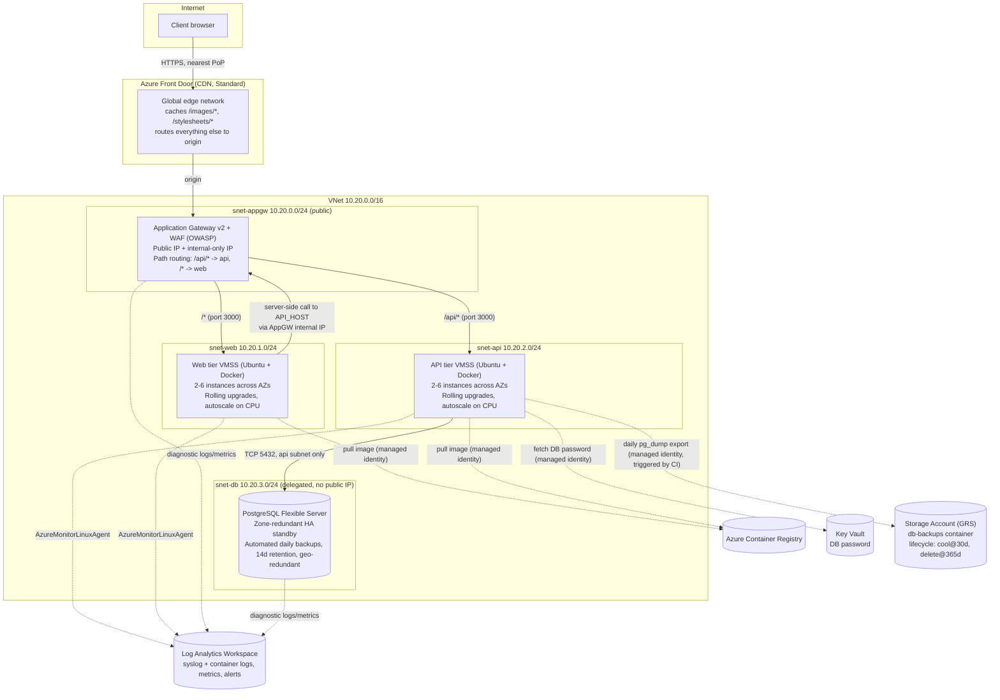

# Architecture: node-3tier-app2 on Azure

This document is the architecture diagram/deck substitute referenced in the
task ("An architectural diagram / PPT to explain your architecture during
the interview"). It's kept as versioned markdown + a Mermaid diagram
(renders natively on git.toptal.com and GitHub) rather than a binary
slide deck, so it stays in sync with the actual Terraform.

## Diagram

## How each requirement is met

| Requirement | Implementation |
|---|---|
| Web and API tiers exposed to the internet | Single Application Gateway v2 (public IP) with **path-based routing**: `/api/*` → API backend pool, `/*` → web backend pool. Both tiers are internet-reachable; only one public IP/WAF policy to manage. |
| DB tier not accessible from the internet | PostgreSQL Flexible Server is **VNet-integrated with no public network access at all** (`delegated_subnet_id`), in a dedicated subnet whose NSG has **no internet-facing inbound rule** and only allows TCP 5432 from the API subnet. |
| Fully provisioned via IaC | All resources (network, ACR, Key Vault, VMSS ×2, App Gateway, Postgres, Log Analytics, Front Door, Storage) are Terraform (`infra/terraform`), organized as reusable modules + one `environments/prod` root. |
| Handles server/instance failures | VMSS spans 3 Availability Zones with `zone_balance = true`; `automatic_instance_repair` replaces any instance that fails its health probe; autoscale keeps a **minimum instance floor** so a failure always gets backfilled, not just detected. Postgres runs **zone-redundant HA** with an automatic-failover standby. |
| Zero-downtime updates | Both VMSS use `upgrade_mode = "Rolling"` with a batched `rolling_upgrade_policy`, gated by the `ApplicationHealthLinux` extension against each container's health endpoint — Terraform apply (new image tag) triggers this automatically, no manual "instance refresh" step. |
| Fully automated deploys (+ tests) | GitLab CI (`.gitlab-ci.yml`): test → build & push to ACR (tag = git SHA) → `terraform plan` → `terraform apply` (updates the VMSS image tag, which the Rolling policy rolls out). Unit/integration tests run for both tiers on every push (API tests run against a real Postgres service container). |
| Backups at least daily | Postgres Flexible Server **automated backups** (`backup_retention_days = 14`, geo-redundant) are always-on, config-only. As a supplementary, portable export, a scheduled GitLab CI pipeline (`infra/scripts/backup/trigger-daily-backup.sh`) runs `pg_dump` on a single API instance (via `az vmss run-command`, no VNet access needed from the runner) and uploads the compressed dump to a geo-redundant Storage Account with lifecycle tiering. |
| Logs accessible off-host | Every VMSS instance runs the `AzureMonitorLinuxAgent` extension shipping syslog/container (journald) logs to a central **Log Analytics workspace** via a Data Collection Rule; App Gateway and Postgres diagnostic logs go to the same workspace. Nothing is queried by SSH-ing into a host. |
| Historical metrics / bottleneck spotting | Log Analytics + Azure Monitor metrics (CPU, App Gateway request/latency/unhealthy-host-count, Postgres metrics) with 90-day retention, queryable via KQL/Workbooks; a metric alert fires on unhealthy backend hosts. |
| CDN, geo-distributed | Azure Front Door (Standard) fronts the Application Gateway: static assets (`/images/*`, `/stylesheets/*`) are cached and served from the edge PoP nearest each client; dynamic HTML/API responses bypass the cache and always hit origin. |
| Deployable on a major cloud provider | Azure, chosen deliberately. |

## Compute model: why VMSS + Docker + ACR, not AKS/Container Apps

The app isn't containerized upstream and the task explicitly calls for
"runtime handling scripts (start/stop/scale nodes)" — language that implies
VM-level operational control, which a fully managed platform like Container
Apps/AKS abstracts away entirely (no "node" to start/stop). VM Scale Sets
give:

- A genuine "node" to script against (`infra/scripts/runtime/{start,stop,scale}.sh`).
- Native rolling, health-gated updates (no custom orchestration needed).
- Docker without a custom VM image pipeline: the base image is static
  (Ubuntu + Docker + Azure Monitor Agent, provisioned once via `custom_data`
  cloud-init); only the **container image tag** changes per deploy, pulled
  from ACR using the instance's managed identity (no registry credentials
  stored anywhere).

## Known simplifications / what a longer engagement would add

- **TLS**: the Application Gateway listener is HTTP-only for this exercise.
  Production would add an HTTPS listener with a certificate from Key Vault
  and enforce `https_redirect_enabled`.
- **CI trust model**: the pipeline authenticates to Azure via a service
  principal client secret (`ARM_CLIENT_ID`/`ARM_CLIENT_SECRET`); GitLab
  supports OIDC federation with Azure workload identity, which would remove
  the long-lived secret.
- **`terraform apply` is a manual CI gate** (approve after reviewing the
  plan) rather than fully unattended, since unattended infrastructure
  changes are a different risk profile than unattended *application*
  deploys (which this pipeline does fully automate via the image tag).
